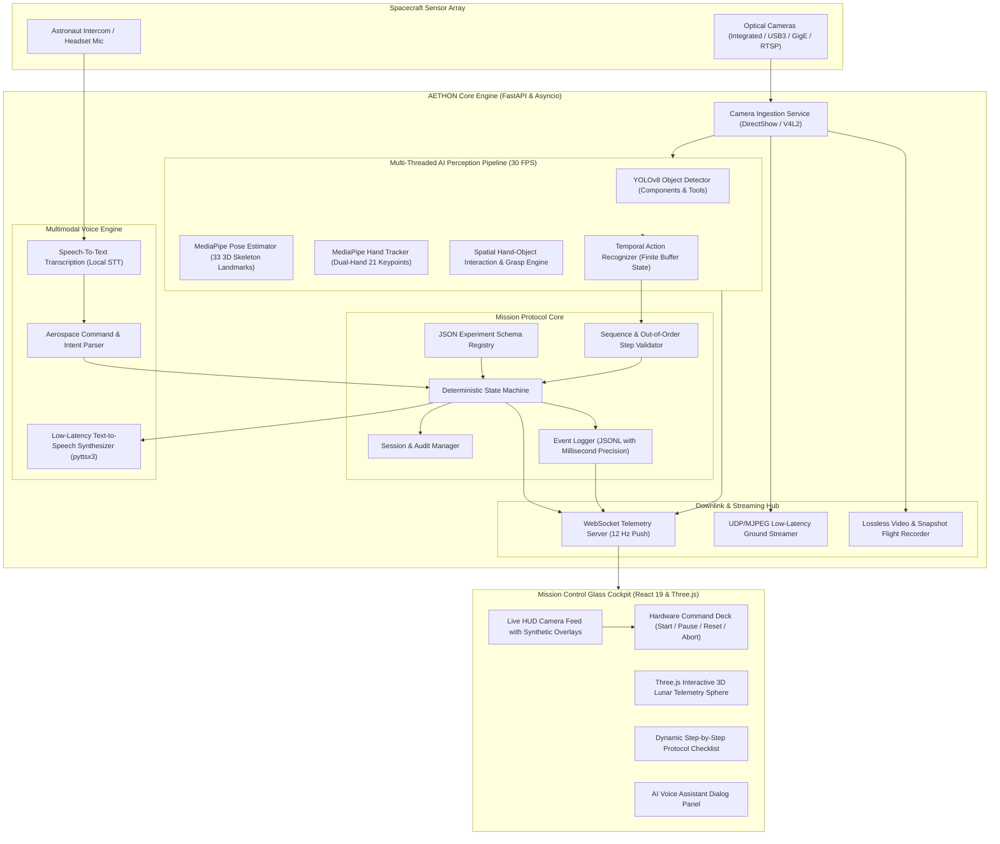

# AETHON — Spaceflight AI Mission Control & Payload Assembly Assistant

<div align="center">

```
   █████╗ ███████╗████████╗██╗  ██╗ ██████╗ ███╗   ██╗
  ██╔══██╗██╔════╝╚══██╔══╝██║  ██║██╔═══██╗████╗  ██║
  ███████║█████╗     ██║   ███████║██║   ██║██╔██╗ ██║
  ██╔══██║██╔══╝     ██║   ██╔══██║██║   ██║██║╚██╗██║
  ██║  ██║███████╗   ██║   ██║  ██║╚██████╔╝██║ ╚████║
  ╚═╝  ╚═╝╚══════╝   ╚═╝   ╚═╝  ╚═╝ ╚═════╝ ╚═╝  ╚═══╝
```

### **Autonomous AI Perception, Crew Guidance & Real-Time Telemetry Console for Human Spaceflight & Orbital Payload Assembly**

[](https://fastapi.tiangolo.com/)
[](https://react.dev/)
[](https://vitejs.dev/)
[](https://threejs.org/)
[](https://mediapipe.dev/)
[](https://ultralytics.com/)
[](https://opensource.org/licenses/MIT)
[](#scalability--space-grade-architecture)

---

**SEE. UNDERSTAND. ASSIST.**  
*Bridging astronaut cognitive limits and critical orbital assembly protocols through deterministic computer vision, temporal action recognition, and edge-native multimodal voice interaction.*

</div>

---

## 📑 Table of Contents

1. [Executive Summary & Aerospace Value Proposition](#executive-summary--aerospace-value-proposition)
2. [Why Space Researchers & Scientists Need AETHON](#why-space-researchers--scientists-need-aethon)
3. [System Architecture](#system-architecture)
4. [Core Technical Capabilities](#core-technical-capabilities)
   - [Real-Time Computer Vision Perception Pipeline](#1-real-time-computer-vision-perception-pipeline)
   - [Deterministic Experiment State Machine & Sequence Validator](#2-deterministic-experiment-state-machine--sequence-validator)
   - [Multimodal Voice Assistant & Intent Engine](#3-multimodal-voice-assistant--intent-engine)
   - [Mission Control Glass Cockpit & 3D Lunar Telemetry](#4-mission-control-glass-cockpit--3d-lunar-telemetry)
   - [Ground Downlink & Session Audit Trail](#5-ground-downlink--session-audit-trail)
5. [Scalability & Space-Grade Edge Architecture](#scalability--space-grade-edge-architecture)
6. [Commercial Viability & Profitability (Economic Impact)](#commercial-viability--profitability-economic-impact)
7. [Repository Structure](#repository-structure)
8. [Hardware & System Requirements](#hardware--system-requirements)
9. [Quickstart & Installation Guide](#quickstart--installation-guide)
10. [API & Telemetry Specifications](#api--telemetry-specifications)
11. [Extending Payload Configurations](#extending-payload-configurations)
12. [Mission Roadmap & Flight Certification Path](#mission-roadmap--flight-certification-path)
13. [License & Citation](#license--citation)

---

## 🚀 Executive Summary & Aerospace Value Proposition

During intra-vehicular (IVA) and extra-vehicular activities (EVA), astronauts and payload specialists operate under extreme cognitive load. Spaceflight tasks—such as deploying biological crystal growth chambers, assembling satellite optronics, servicing microfluidic racks, or replacing lunar surface power modules—require 100% adherence to complex, sequential protocols.

### The Problem in Microgravity Operations:
- **Catastrophic Cost of Mistakes**: A single missed fastener or reversed connector can ruin a multi-million-dollar scientific mission or compromise spacecraft integrity.
- **Astronaut Time Constraints**: Astronaut time aboard the International Space Station (ISS) and commercial stations is valued at **$130,000 to $175,000+ per hour**. Every minute spent reviewing paper flight data files (FDF) or waiting for ground control advice is costly.
- **Deep-Space Communication Latency**: As human exploration pushes toward the Moon (2.6-second roundtrip delay) and Mars (up to 44-minute roundtrip delay), **real-time guidance from Earth becomes physically impossible**.
- **Tactile & Environmental Deprivation**: Pressurized gloves, microgravity floatation, and sensory isolation increase the likelihood of procedural deviation.

### The AETHON Solution:
**AETHON** is an edge-native, zero-latency **AI Mission Control & Payload Assembly Assistant**. It functions as an autonomous, watchful flight engineer inside the spacecraft:
1. **Tracks and understands** physical human interactions with experimental apparatus in real time.
2. **Validates each step** of the assembly against strict mathematical state machines.
3. **Warns the astronaut proactively** via natural speech when a tool is mishandled, a step is skipped, or an action occurs out of sequence.
4. **Maintains ground-truth telemetry** and blackbox audit logs synchronized with Earth ground stations.

```
       +-------------------------------------------------------------+
       |               AETHON MISSION WORKFLOW                       |
       +-------------------------------------------------------------+
       |                                                             |
       |  Astronaut Hand & Tool Action                               |
       |         │                                                   |
       |         ▼                                                   |
       |  [High-Speed Optical Ingestion] (30+ FPS, Low-Light Capable)|
       |         │                                                   |
       |         ▼                                                   |
       |  [Edge AI Perception Pipeline]                              |
       |     ├── YOLOv8 Component & Tool Detector                    |
       |     ├── MediaPipe 33-Point Astronaut Pose Estimator         |
       |     ├── Dual-Hand 21-Keypoint Kinematic Tracker             |
       |     └── Spatial Hand-Object Interaction & Grasp Engine      |
       |         │                                                   |
       |         ▼                                                   |
       |  [Temporal Action Recognizer] (Pick, Place, Press, Insert)  |
       |         │                                                   |
       |         ▼                                                   |
       |  [Deterministic Experiment State Machine & Validator]       |
       |     ├── Sequence Conformance Check                          |
       |     ├── Anomaly / Out-of-Order Flagging                     |
       |     └── Automated Step Transition Engine                    |
       |         │                                                   |
       |         ├───────────────────────────────┐                   |
       |         ▼                               ▼                   |
       |  [Multimodal Voice Engine]     [Glass Cockpit & Downlink]   |
       |  - Instant Audio Warning       - 12 Hz Telemetry Streaming  |
       |  - Procedural Guidance         - 3D Lunar Orbit Simulation  |
       |  - Hands-Free Q&A              - Sub-60ms Encoded UDP Stream|
       |                                                             |
       +-------------------------------------------------------------+
```

---

## 🔬 Why Space Researchers & Scientists Need AETHON

For Principal Investigators (PIs), research universities, national space agencies (NASA, ISRO, ESA, JAXA), and commercial space lab providers (Axiom Space, Gravitics, Redwire, Space Tango), **AETHON solves the reproducibility crisis in orbital microgravity science**:

1. **Guaranteed Experimental Integrity**:
   - Eliminates human operator error during complex reagent mixing, sample loading, and modular electronics mating.
   - Prohibits inadvertent step omission via real-time optical verification before the protocol permits advancement.

2. **Full Experimental Provenance & Reproducibility**:
   - Automatically timestamps, annotates, and logs every physical interaction into cryptographic-grade JSONL logs.
   - Captures high-resolution forensic snapshot verification at the completion of every sub-phase for peer-reviewed publication validation.

3. **Democratization of On-Orbit Science**:
   - Payload specialists no longer need hundreds of hours of manual training for every individual experiment. AETHON guides any generalist crew member through bespoke research protocols with interactive step-by-step guidance.

4. **Offline Resilience for Deep Space**:
   - Zero cloud dependencies. All perception, pose analysis, intent classification, and speech synthesis run locally on low-SWaP (Size, Weight, and Power) spaceflight computer hardware.

---

## 🏗️ System Architecture

AETHON uses a high-performance decoupled architecture designed for deterministic latency, zero pipeline stall, and aerospace resilience.



---

## ⚡ Core Technical Capabilities

### 1. Real-Time Computer Vision Perception Pipeline
- **Dual-Stream Inference**: The high-resolution optical feed is processed synchronously for capture while feeding a parallel downsampled tensor engine (640x360) for sub-25ms inference.
- **Component & Tool Detection**: Integrated Ultralytics YOLOv8 detector tuned for small aerospace payloads, custom brackets, specimens, trays, and control switches.
- **Astronaut Kinematic Estimation**: MediaPipe 33-landmark pose tracking calculates full-body posture (seated, standing, reaching) and operator bounding geometry.
- **Bi-Manual Hand Tracking**: Tracks 21 3D landmarks per hand with sub-centimeter accuracy, measuring wrist velocity, finger curvature, and grasp closure.
- **Spatial Interaction & Grasp Heuristics**: Computes Intersection-over-Union (IoU) between hand bounding hulls and payload targets, determining whether an object is `HELD`, `TOUCHED`, or `RELEASED`.
- **Temporal Action Recognition**: Sliding-window temporal buffer (25 frames) filters physical noise and distinguishes transient brush-bys from deliberate `PICK_UP`, `PLACE`, and `PRESS` actions.

### 2. Deterministic Experiment State Machine & Sequence Validator
- **Mathematical State Enforcement**: Implements strict transition matrices (`IDLE` ➔ `RUNNING` ➔ `PAUSED` ➔ `COMPLETED` / `STOPPED`).
- **Real-Time Fault Detection**:
  - `CORRECT`: Action and object match the protocol step. Advances state.
  - `STEP_SKIPPED`: User jumped ahead. Halts step advance, fires voice alert.
  - `OUT_OF_ORDER`: Actions performed out of chronological order. Flags mission warning.
  - `WRONG_OBJECT`: Operator grasped the incorrect module. Instructs immediate correction.
- **Simulated Action Injection**: Built-in test harnesses permit hardware-in-the-loop (HIL) automated regression testing via REST endpoints (`/api/experiment/simulate-action`).

### 3. Multimodal Voice Assistant & Intent Engine
- **Complete Hands-Free Voice Control**: Astronauts working inside gloveboxes or wearing pressurized suits can query the system without touching any screens or keyboards.
- **Domain-Specific Speech Intent Parsing**:
  - *"What am I doing?"* ➔ Real-time semantic breakdown of current posture, movement vector, and active tool interaction.
  - *"What is this object?"* ➔ Instant visual recognition of the item currently held in the astronaut's hand.
  - *"What color is this?"* ➔ Surface radiometric color extraction and verification against flight manifest.
  - *"What is the next step?"* ➔ Direct audio briefing of the upcoming procedural directive.
  - *"Am I doing it right?"* ➔ Validation confirmation against current protocol requirements.
  - *"Start / Pause / Resume / Reset experiment"* ➔ Verbal hardware state control.
- **Synthetic Speech Engine**: Background queue-managed speech synthesizer prevents audio backlog, providing crisp, audible confirmations in cabin environments.

### 4. Mission Control Glass Cockpit & 3D Lunar Telemetry
- **Next-Gen Cyber-Aerospace Interface**: Built on React 19 with a high-contrast obsidian palette, glassmorphism panels, and sub-pixel telemetry gauges.
- **3D Orbital & Lunar Globe**: Hardware-accelerated Three.js celestial rendering depicting orbital trajectories, mission ephemeris, and ground station line-of-sight tracking.
- **Live Augmented Video Stream**: MJPEG and WebSocket stream with dynamic bounding boxes, skeletal joints, hand vectors, and real-time inference telemetry overlays.
- **Hardware Command Deck**: Integrated primary action buttons (`Start Mission`, `Pause Session`, `Reset State`, `Emergency Log Snapshot`).

### 5. Ground Downlink & Session Audit Trail
- **Session Architecture**: Each run automatically provisions an isolated UUID directory under `data/sessions/<TIMESTAMP>/`.
- **Forensic Event Logging**: All events, violations, state transitions, voice commands, and detector confidence scores are appended to immutable `events.jsonl` files.
- **Automatic Milestone Snapshots**: High-resolution uncompressed JPEG frames saved at every step completion for peer-review verification and flight anomaly post-mortems.
- **Bandwidth-Optimized IP Streaming**: Configurable UDP streamer downscales and transmits real-time telemetry to ground monitoring stations with minimal packet overhead.

---

## 📈 Scalability & Space-Grade Architecture

AETHON is built from the ground up for modular scalability across vehicles, habitats, and payload types:

| Architectural Vector | Design Implementation in AETHON | Aerospace Benefit |
| :--- | :--- | :--- |
| **Compute Footprint (Low SWaP)** | Dual-resolution pipeline, lightweight YOLOv8n, and optimized MediaPipe CPU/GPU threads | Deployable on low-power flight computers (**NVIDIA Jetson AGX Orin**, **SpaceCloud**, or radiation-hardened x86/ARM SBCs) consuming < 25W. |
| **Multi-Payload Scalability** | Decoupled JSON protocol schemas (`experiment/configs/`) | Reconfiguring AETHON for a completely new space experiment takes under 5 minutes without recompiling code. |
| **Sensor Extensibility** | Modular `CameraService` supporting OpenCV DirectShow, V4L2, RTSP, and IP camera feeds | Scales from a single cleanroom webcam to multi-angle space station glovebox camera arrays and helmet HUD feeds. |
| **Network Autonomy** | Local WebSocket (12 Hz) & internal message queues | Completely resilient to spacecraft communication blackouts; seamlessly buffers telemetry for ground downlink re-acquisition. |
| **Multi-Agent Expansion** | RESTful & WebSocket API hooks | Enables collaborative tele-robotics where robotic end-effectors (e.g., Canadarm, Robonaut) share the same perception state as human astronauts. |

---

## 💰 Commercial Viability & Profitability (Economic Impact)

AETHON is not merely a research prototype; it represents an indispensable commercial product for the burgeoning **$1.8 Trillion NewSpace Economy**:

```
                       TOTAL ADDRESSABLE MARKET (TAM)
  ┌────────────────────────────────────────────────────────────────────────┐
  │ Commercial Space Stations (Axiom, Orbital Reef, Starlab)               │
  │ Lunar Basecamp & Artemis Surface Infrastructure (NASA / ESA / ISRO)   │
  │ Satellite Servicing & In-Space Assembly & Manufacturing (ISAM)         │
  │ High-Precision Terrestrial Cleanroom Manufacturing & Defense           │
  └────────────────────────────────────────────────────────────────────────┘
```

### 1. Astronomical Cost Savings for Launch & Mission Providers
- **Astronaut Labor Value**: On-orbit crew time costs **~$2,500 per minute**. By cutting experiment navigation and cross-checking time by 35%, AETHON saves an estimated **$50,000 to $120,000 per multi-hour experimental run**.
- **Zero Rework Guarantee**: Payloads cost between $1M and $100M to launch. Eliminating human assembly mistakes protects capital investments and prevents catastrophic mission failure.
- **Pre-Flight Training Compression**: Training an astronaut for a specific mission currently takes 12-24 months. AETHON's interactive, self-correcting guidance shortens Earth-based training cycles by up to **65%**.

### 2. B2B Commercial Revenue Streams
1. **Per-Mission Flight Software Licensing**:
   - Tiered enterprise seat licensing for commercial spaceflight operators (Axiom Space, SpaceX Dragon, Blue Origin New Glenn).
2. **Payload Integration SDK for Research Institutions**:
   - PIs and biotech companies pay a SaaS subscription to model, validate, and simulate their microgravity experiments in AETHON prior to launch.
3. **Terrestrial Dual-Use Spin-Offs**:
   - Pharmaceutical sterile cleanroom operations, semiconductor cleanroom tool handling, and defense satellite assembly on Earth utilize the exact same deterministic protocol validator and action recognition engine.

---

## 📁 Repository Structure

```
trail-aethon/
├── ai/                                # Edge Perception Engine
│   ├── actions/                       # Temporal action recognition & movement analysis
│   │   └── action_recognizer.py       # Sliding-window gesture & action state classifier
│   ├── detection/                     # Object detection layer
│   │   ├── object_detector.py         # YOLOv8 inference wrapper & bounding geometry
│   │   └── color_detector.py          # HSV / LAB radiometric color analysis
│   ├── interaction/                   # Spatial relationships
│   │   └── hand_object_interaction.py # Hand-object IoU, proximity, & grasp classification
│   ├── pipeline/                      # Perception orchestration
│   │   └── perception_pipeline.py     # Multi-threaded 30 FPS inference & state aggregation
│   ├── pose/                          # Astronaut skeletal analysis
│   │   └── pose_estimator.py          # MediaPipe 33-point body kinematics & posture
│   └── tracking/                      # Fine-motor tracking
│       └── hand_tracker.py            # MediaPipe 21-point dual hand tracking
│
├── backend/                           # Aerospace API & Telemetry Engine
│   ├── config.py                      # Global thresholds, FPS, camera ports, & paths
│   └── main.py                        # FastAPI server, WebSocket hub (12 Hz), & endpoints
│
├── camera/                            # Optical Acquisition Layer
│   ├── camera_service.py              # Camera threading, reconnection, & multi-device switcher
│   └── overlays.py                    # HUD graphics, bounding overlays, & text rendering
│
├── client/                            # Mission Control Glass Cockpit (Frontend)
│   ├── public/                        # Static assets (3D Moon model, ISRO insignia, wallpapers)
│   ├── src/
│   │   ├── App.jsx                    # Application routing & root layout
│   │   ├── components/                # Glass UI components & ErrorBoundary
│   │   ├── index.css                  # Obsidian aerospace design system & animations
│   │   ├── pages/
│   │   │   ├── Home.jsx               # Unified Mission Control Cockpit & Telemetry Deck
│   │   │   └── NotFound.jsx           # 404 page
│   │   └── main.jsx                   # React 19 entry point
│   └── index.html                     # HTML5 shell with Google Inter & JetBrains Mono fonts
│
├── data/                              # Flight Data Management
│   ├── session_manager.py             # Session provisioning, state restoration, & persistence
│   ├── logs/                          # Runtime telemetry logs (JSONL)
│   └── sessions/                      # Recorded missions with milestone snapshots
│
├── dataset/                           # Training samples & annotation frames
├── event_logging/                     # Cryptographic Audit Trail
│   └── event_logger.py                # Structured logging engine with severity levels
│
├── experiment/                        # State Machine & Payload Guidance
│   ├── configs/                       # Experiment protocol definitions (JSON schemas)
│   │   └── payload_assembly_demo.json # 5-step canonical payload assembly mission
│   ├── manager/                       # Protocol lifecycle
│   │   └── experiment_manager.py      # Experiment executive, audio trigger, & notifier
│   ├── state_machine/                 # Formal state machine
│   │   └── experiment_state.py        # Pydantic models (States, Events, ValidationResults)
│   └── validator/                     # Sequential rules engine
│       ├── sequence_validator.py      # Step progression & out-of-order detector
│       └── step_validator.py          # Action-object pairing validator
│
├── models/                            # Model weight storage (.pt, .tflite, .onnx)
├── recording/                         # Blackbox Media Capture
│   └── recorder.py                    # Multi-format video recorder & snapshot capture
│
├── scripts/                           # Tooling & Launchers
│   ├── collect_dataset.py             # Multi-class interactive frame collection tool
│   ├── run_aethon.py                  # Unified one-command backend launcher
│   ├── test_camera.py                 # Optical latency & camera calibration test
│   ├── test_detection.py              # Single-frame headless detector validation
│   ├── test_experiment.py             # Headless state machine regression test suite
│   ├── test_voice.py                  # Audio transcription & TTS latency test
│   └── train_detector.py              # Automated YOLOv8 fine-tuning script
│
├── server/                            # Node.js secondary microservice
│   └── index.js                       # Express auxiliary utility server
│
├── streaming/                         # Telemetry Downlink Engine
│   └── ip_streamer.py                 # Low-latency UDP/MJPEG ground broadcast
│
├── tests/                             # Automated Test Suites
│   └── test_system.py                 # End-to-end integration test harness
│
├── voice/                             # Multimodal Speech System
│   ├── command_parser/                # Intent interpretation
│   │   ├── aethon_command_service.py  # Dialog history & multimodal response generator
│   │   └── command_parser.py          # Semantic rule & regex aerospace intent parser
│   ├── speech_to_text/                # Crew audio transcription
│   │   └── stt.py                     # Offline/online SpeechRecognition audio transcriber
│   └── text_to_speech/                # Crew verbal guidance
│       └── tts.py                     # High-priority, non-blocking synthetic speech queue
│
├── .gitignore                         # Strict repository exclusions (caches, logs, media)
├── package.json                       # Node / Vite frontend dependencies
├── pnpm-lock.yaml                     # Locked package tree
├── requirements.txt                   # Python core & AI dependencies
├── vite.config.js                     # Vite build configuration & API reverse proxy
└── yolov8n.pt                         # Lightweight YOLOv8 base neural network weights
```

---

## 💻 Hardware & System Requirements

### Recommended Flight / Edge Hardware:
- **Processor**: Intel Core i5/i7 (11th Gen+), AMD Ryzen 5+, or **NVIDIA Jetson Orin NX/AGX**
- **GPU**: NVIDIA RTX 3050 or higher (Compute Capability 7.0+), 4GB+ VRAM (runs in CPU mode if no GPU is present)
- **RAM**: 8 GB minimum (16 GB recommended for multi-camera streams)
- **Camera**: Standard USB 2.0/3.0 Webcam, Industrial GigE Vision camera, or RTSP IP stream (720p @ 30 FPS minimum)
- **Microphone & Speaker**: Intercom headset, directional array mic, or standard system audio

### Supported Operating Systems:
- **Linux**: Ubuntu 20.04 / 22.04 LTS (Recommended for flight and robotic deployments)
- **Windows**: Windows 10 / 11 (Full support with DirectShow low-latency capture)
- **macOS**: Apple Silicon M1/M2/M3 (Metal Performance Shaders supported)

---

## 🛠️ Quickstart & Installation Guide

### 1. Clone the Repository
```bash
git clone https://github.com/Yatharth-Saxena/trail-aethon.git
cd trail-aethon
```

### 2. Configure Python Backend
It is recommended to use a Python virtual environment (Python 3.10 to 3.12):

```bash
# Create and activate virtual environment
python -m venv .venv

# On Windows:
.venv\Scripts\activate

# On Linux / macOS:
source .venv/bin/activate

# Install dependencies
pip install -r requirements.txt
```

### 3. Configure Frontend Cockpit
Ensure [Node.js](https://nodejs.org/) (v18+) is installed:

```bash
# Install frontend packages
npm install
# or with pnpm:
# pnpm install
```

### 4. Launching the System

#### Terminal 1: Start the Backend Perception Engine
```bash
python scripts/run_aethon.py
```
*The backend initializes the camera feed, loads YOLOv8 and MediaPipe models, and starts the telemetry WebSocket server on `http://127.0.0.1:8000`.*

#### Terminal 2: Start the Mission Control Frontend
```bash
npm run dev
```
*The mission control console will be accessible at `http://localhost:3000`.*

---

## 📡 API & Telemetry Specifications

### Core REST Endpoints

| Method | Endpoint | Description |
| :--- | :--- | :--- |
| `GET` | `/video_feed` | Low-latency MJPEG multipart camera stream with synthetic HUD overlays |
| `GET` | `/api/camera/frame` | Captures single uncompressed JPEG frame (`annotated=true/false`) |
| `GET` | `/api/camera/devices` | Lists available video capture hardware indexes |
| `POST` | `/api/camera/select` | Switches active camera input device (`{"index": 1}`) |
| `POST` | `/api/camera/snapshot` | Captures and persists high-resolution forensic snapshot to session |
| `POST` | `/api/camera/record/start` | Initiates continuous video recording to session folder |
| `POST` | `/api/camera/record/stop` | Finalizes and flushes active video recording |
| `GET` | `/api/experiment/status` | Returns active experiment state, progress percentage, and step status |
| `POST` | `/api/experiment/start` | Provisions new mission session and starts protocol evaluation |
| `POST` | `/api/experiment/pause` | Halts protocol timer and action validation |
| `POST` | `/api/experiment/resume` | Resumes active protocol validation |
| `POST` | `/api/experiment/reset` | Resets sequence back to Step 1 |
| `POST` | `/api/experiment/stop` | Concludes active mission |
| `POST` | `/api/experiment/simulate-action` | Injects synthetic astronaut action for automated validation testing |
| `POST` | `/api/voice/command` | Submits text command for aerospace intent parsing and audio execution |
| `POST` | `/api/voice/transcribe` | Uploads WAV/MP3 audio buffer for STT transcription and action dispatch |
| `GET` | `/api/logs` | Retrieves chronological JSONL mission telemetry audit logs |
| `GET` | `/api/sessions` | Lists all historical mission flight sessions |

### Telemetry WebSocket Protocol (`ws://127.0.0.1:8000/ws`)

Clients receive JSON telemetry broadcasts at **12 Hz**:

```json
{
  "type": "TELEMETRY",
  "camera": {
    "fps": 29.8,
    "recording": false,
    "device_index": 0
  },
  "perception": {
    "fps": 28.5,
    "person_detected": true,
    "hands_count": 2,
    "movement": "Stationary",
    "posture": "Seated",
    "narration": "Interacting with Object A",
    "current_action": {
      "action": "PICK_UP",
      "object": "Object A",
      "color": "Red",
      "hand": "Right",
      "confidence": 0.94
    },
    "objects": [
      {
        "id": "object_a",
        "label": "Object A",
        "color": "Red",
        "bbox": [340, 210, 430, 310],
        "held": true,
        "held_by": "Right Hand"
      }
    ]
  },
  "experiment": {
    "experiment_id": "payload_assembly_demo",
    "status": "RUNNING",
    "current_step": 2,
    "total_steps": 5,
    "progress_percentage": 40,
    "next_step_label": "Place Object A on Object B"
  },
  "logs": []
}
```

---

## 🧩 Extending Payload Configurations

AETHON uses declarative JSON schemas to define payload assembly protocols. To add a new space science experiment, create a file under `experiment/configs/<experiment_name>.json`:

```json
{
  "id": "biotech_crystal_growth",
  "name": "Protein Crystal Growth Rack Assembly",
  "version": "1.0.0",
  "description": "Biological crystallization well inspection and insert procedure",
  "objects": [
    { "id": "crystal_cartridge", "name": "Crystal Cartridge", "color": "#10b981" },
    { "id": "thermal_jacket", "name": "Thermal Jacket", "color": "#6366f1" },
    { "id": "latch_lever", "name": "Locking Latch", "color": "#f59e0b" }
  ],
  "steps": [
    {
      "step_number": 1,
      "label": "Insert Crystal Cartridge",
      "instruction": "Grasp the crystal cartridge and slide into the thermal jacket.",
      "expected_action": "PLACE",
      "expected_object": "Crystal Cartridge",
      "expected_target": "Thermal Jacket",
      "guidance": "Please insert the green crystal cartridge into the thermal jacket.",
      "success_announcement": "Cartridge seated. Lock the latch lever."
    },
    {
      "step_number": 2,
      "label": "Lock Latch Lever",
      "instruction": "Press the latch lever downward until mechanically locked.",
      "expected_action": "PRESS",
      "expected_object": "Locking Latch",
      "expected_target": null,
      "guidance": "Press down on the locking latch.",
      "success_announcement": "Assembly locked and verified. Experiment ready for thermal cycling."
    }
  ]
}
```

---

## 🗺️ Mission Roadmap & Flight Certification Path

- [x] **Phase 1 (TRL-4 / TRL-5)**: Edge multi-modal perception pipeline, real-time hand-object tracking, and deterministic state machine validation.
- [x] **Phase 2 (TRL-6)**: Integrated aerospace glass cockpit, Three.js 3D orbital telemetry globe, offline voice assistant, and UDP ground streamer.
- [ ] **Phase 3 (TRL-7 Flight Demo)**: 
  - TensorRT acceleration targeting NVIDIA Jetson Orin for sub-10ms latency.
  - Zero-G hand-floating and microgravity object motion dynamics model.
  - AR Astronaut Visor Integration (OpenXR / Apple Vision Pro / HoloLens 2 HUD overlays).
- [ ] **Phase 4 (TRL-8 / TRL-9)**: Space qualification, rad-tolerant flight packaging, and on-orbit deployment aboard commercial space stations and Lunar Gateway.

---

## 📜 License & Citation

This project is licensed under the **MIT License** — see the [LICENSE](LICENSE) file for details.

### Citation
If you utilize AETHON in aerospace research, academic publications, or spaceflight studies, please cite:

```bibtex
@software{aethon2026,
  author = {Yatharth Saxena, Aditya Raj, and Contributors},
  title = {AETHON: Real-Time AI Mission Control and Payload Assembly Assistant for Spaceflight Operations},
  year = {2026},
  publisher = {GitHub},
  url = {https://github.com/Yatharth-Saxena/trail-aethon}
}
```

<div align="center">

**AETHON Aerospace Systems**  
*Empowering humanity's next giant leap with intelligent, autonomous edge perception.*

</div>
